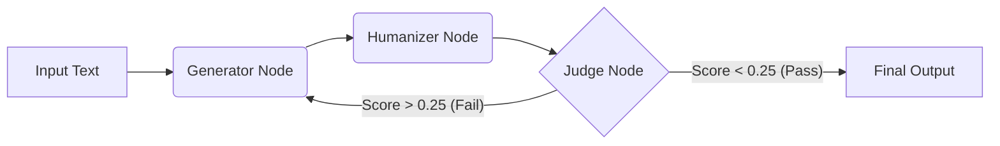

# Adversarial Agentic Workflow


This is an autonomous agentic pipeline designed to bypass AI detection algorithms. It utilizes a **Directed Cyclic Graph (DCG)** where a Generator agent and a Forensic Judge agent lock into an adversarial feedback loop, iteratively refining text until it meets strict standards.

---

## System Architecture

The core of this project is built on **LangGraph**, utilizing a stateful graph architecture to manage the lifecycle of a text transformation.


---

## The Agentic Loop

1.  **Generator:** An LLM instructed in "University-Level Academic Register." It employs specific linguistic strategies like **Nominalization** (turning verbs into nouns to increase density) and **Sentence Burstiness** to mimic human variance.
2.  **Humanizer:** To break the consistent patterns of LLMs, the text undergoes **Semantic Round-Tripping**:
    * English → Japanese → German → English
    * This exploits translation imperfections to introduce natural syntactic variation.
3.  **Judge:** A separate LLM instance acting as a forensic linguist. It analyzes the text for:
    * AI indicator words
    * Sentence length consistency
    * Logic errors introduced by the Humanizer

---

## Key Features

* **Adversarial Feedback Loop:** The generator receives specific, actionable feedback from the Judge (e.g., *"Text is too verbose, use Nominalization"* or *"Translation artifacts detected"*).
* **Semantic Round-Tripping:** Uses `deep-translator` to physically break AI sentence structures via multi-hop translation.
* **Strict Typing:** Implemented using Python's `TypedDict` for robust state management across graph nodes.
* **Forensic Guardrails:** Hard-coded logic to detect and penalize high-frequency AI tokens ("AI Hallucinations").

---

## Installation & Setup

### Prerequisites
* Python 3.9+
* A [Groq API Key](https://console.groq.com/) (Free tier available)

### Steps

1.  **Clone the Repository**
    ```bash
    git clone [https://github.com/YOUR_USERNAME/GhostWriter.git](https://github.com/YOUR_USERNAME/GhostWriter.git)
    cd GhostWriter
    ```

2.  **Install Dependencies**
    ```bash
    pip install -r requirements.txt
    ```

3.  **Environment Configuration**
    Create a `.env` file in the root directory:
    ```env
    GROQ_API_KEY=gsk_your_api_key_here
    ```

4.  **Run the Application**
    ```bash
    streamlit run main.py
    ```

## License
MIT.
